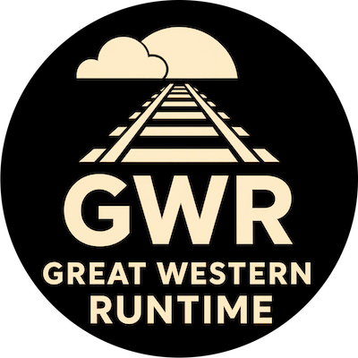

<!-- Copyright (c) 2023 Graphcore Ltd. All rights reserved. -->

[](https://github.com/graphcore-research/gwr/actions/workflows/ci.yaml)
[](https://github.com/graphcore-research/gwr/actions/workflows/online-documentation.yaml)

<div align="center">



[Developer guide] | [API documentation]

</div>

[Developer guide]: https://graphcore-research.github.io/gwr
[API documentation]:
  https://graphcore-research.github.io/gwr/rustdoc/gwr_engine/index.html

# GWR

<!-- ANCHOR: intro -->

Welcome to the GWR project. The core GWR packages are developed as a monorepo,
which together provide the following functionality:

- An event-driven [simulation engine].
- [Logging] and [log viewing] system.
- Hierarchical configuration support.
- Documentation tooling.
- A library of [components] and basic [models].
- A set of [example applications].

## Simple simulation example

This example shows how the GWR engine and components can be used to create a
simple simulation. This simulation connects a source, which will transmit 10
objects, to a sink, which counts the number of objects it receives.

```rust
use gwr_components::sink::Sink;
use gwr_components::source::Source;
use gwr_components::{connect_port, option_box_repeat};
use gwr_engine::engine::Engine;
use gwr_engine::run_simulation;

fn main() {
  let mut engine = Engine::default();
  let clock = engine.default_clock();
  let mut source = Source::new_and_register(&engine, engine.top(), "source", option_box_repeat!(0x123 ; 10))
      .expect("should be able to create and register `Source`");
  let sink = Sink::new_and_register(&engine, &clock, engine.top(), "sink")
      .expect("should be able to create and register `Sink`");
  connect_port!(source, tx => sink, rx)
      .expect("should be able to connect `Source` to `Sink`");
  run_simulation!(engine);
  assert_eq!(sink.num_sunk(), 10);
}
```

<!-- ANCHOR_END: intro -->

[components]: gwr-developer-guide/md_src/components/chapter.md
[example applications]: gwr-developer-guide/md_src/applications/examples.md
[log viewing]: gwr-developer-guide/md_src/gwr_spotter/chapter.md
[Logging]: gwr-developer-guide/md_src/gwr_track/chapter.md
[models]: gwr-developer-guide/md_src/models/chapter.md
[simulation engine]: gwr-developer-guide/md_src/gwr_engine/chapter.md

<!-- ANCHOR: why_gwr -->

## Why GWR?

GWR aims to provide a complete modelling workflow, supporting silicon chip and
system architecture projects from the initial exploration phase, through more
detailed evaluations, and finally to a full specification and golden reference
quality model.

Async language features are utilised to allow expressive description of physical
world parallelism. An asynchronous runtime executor is included within the
gwr-engine package for this purpose, which supports both event-driven and
clocked modelling.

GWR is designed with scalability in mind, with the aim being to enable both high
accuracy/detailed simulations and large scale simulations in a tractable
timeframe. To meet this goal it is therefore important that both the development
of models using GWR, as well as the execution of these models is efficient. A
developer guide covering the use of the GWR for modelling, as well as API
documentation for each package is included. The general philosophy adopted is to
raise errors as early as possible for developers, so as many as possible will be
at compile time rather than run time, as well as to guard against common errors
such as unconnected or misconnected model components where possible.

Built-in support for external documentation tooling allows for the creation of a
single source of truth which contains both the readable specification and the
executable model. Where appropriate sections of specification and the reference
model for that part of the specification can reside within the same source file
if desired.

Continuous integration is run on both Linux (Ubuntu LTS) and macOS to ensure
ongoing compatibly with whichever platform developers wish to use. A robust
release process is also defined to guarantee semantic versioning of packages and
automated generation of release notes ensuring user upgrade processes are as
smooth as possible.

GWR is written in [Rust] and takes advantage of a number of the features it
offers. In brief summary these are the strong typing system and emphasis on
correctness in Rust, excellent and easy to use tooling and build system, and
excellent runtime performance (which we have found to be on a par with C++).
More information on this, and guides to help get started with the language are
included in the [Rust chapter] of the developer guide.

[Rust]: https://www.rust-lang.org

<!-- ANCHOR_END: why_gwr -->

[Rust chapter]: gwr-developer-guide/md_src/rust/chapter.md

<!-- ANCHOR: tooling_bootstrap -->

## Tooling

All of the required tooling to build and use, and to develop GWR can be
installed using the scripts included within the repo. These scripts are designed
to be used by both users and the CI system.

Dependencies will be installed using package managers where possible, with [APT]
being used on Linux and [Homebrew] on macOS ([Homebrew] itself will be installed
as required if not already avaliable). Various cross-platform package managers
are also used, including [rustup], [Cargo], and [npm].

See the [Using GWR Packages](#using-gwr-packages) and
[Developing GWR Packages](#developing-gwr-packages) sections for further details
on these install scripts.

### Rust Tools

The correct Rust toolchain will automatically be selected and used by [rustup]
when commands are executed from within the GWR directory (or below). This
behaviour is controlled by the the `rust-toolchain.toml` file.

[APT]: https://wiki.debian.org/AptCLI
[Cargo]: https://doc.rust-lang.org/stable/cargo
[Homebrew]: https://brew.sh
[npm]: https://www.npmjs.com
[rustup]: https://rust-lang.github.io/rustup

<!-- ANCHOR_END: tooling_bootstrap -->

<!-- ANCHOR: package_users -->

## Using GWR Packages

For users of the GWR packages a `stable` Rust toolchain is required, as well as
external tools such as [Asciidoctor], [Cap'n Proto], and [mdBook]. All of the
required build dependencies can be installed by running:

```bash
./.github/actions/install-build-dependencies/install.sh
```

<!-- prettier-ignore-start -->

> [!IMPORTANT]
> To ensure that the correct Rust toolchain is used the script must be executed
> from within the GWR directory.

> [!Tip]
> Although the script is interactive, selecting the default option
> (<kbd>Enter</kbd>) at every step is a reasonable choice and will result in a
> working environment.

> [!NOTE]
> Some of the actions taken by the script may request elevated permissions via
> `sudo`.

<!-- prettier-ignore-end -->

[Asciidoctor]: https://asciidoctor.org
[Cap'n Proto]: https://capnproto.org
[mdBook]: https://rust-lang.github.io/mdBook

<!-- ANCHOR_END: package_users -->

<!-- ANCHOR: package_developers -->

## Developing GWR Packages

For developers of the GWR packages both `stable` and `nightly` Rust toolchains
are required, as well external tools such as [cargo-deny], [cargo-about]
[cargo-semver-checks], [Cocogitto], [pre-commit], [Prettier], and [Release-plz].
All of the required development dependencies can be installed by running:

```bash
./.github/actions/install-dev-dependencies/install.sh
```

<!-- prettier-ignore-start -->

> [!IMPORTANT]
> To ensure that the correct Rust toolchain is used the script must be executed
> from within the GWR directory.

> [!Tip]
> Although the script is interactive, selecting the default option
> (<kbd>Enter</kbd>) at every step is a reasonable choice and will result in a
> working environment.

> [!NOTE]
> Some of the actions taken by the script may request elevated permissions via
> `sudo`.

<!-- prettier-ignore-end -->

Finally the pre-commit hooks need to be installed within the cloned copy of the
GWR repo:

```bash
pre-commit install
```

### Branching the Repo

Changes to GWR packages are developed on branches separate to `main` (the
default) branch of the repo, and then incorporated when complete via a pull
request. Long running or collaborative development will likely benefit from
having the branch pushed to the `origin` well in advance of when a pull request
may be opened, and doing so will cause the CI workflows to be run on every
commit.

For short lived branches pushed only at the point of opening a pull request the
branch naming prefix `pr/` should be used, for example, `pr/new-example-app`.
Branches named with this prefix will still cause the pull request specific CI
workflow to run, but will avoid the push specific CI workflow from running until
the point they are merged.

### Committing a Change

All commits made to the GWR repo must follow the [Conventional Commits] 1.0.0
specification. This allows the automatic generation of both a top-level
changelog covering the whole workspace as well as an individual changelog for
each package within the workspace.

When writing a commmit message in this form:

- The set of `type`s that should generally be used can be found in the
  `commit_parsers` array within the `release-plz.toml` configuration file. This
  array also details the sections each type will be included in within the
  changelog.
- The `optional scope` should be used to detail the name of the updated package.
  For example:

  ```text
  fix(gwr-developer-guide): check for panic when running mdBook tests
  ```

  - If the change applied to multiple, but not all packages, the names should be
    comma seperated. For example:
    ```text
    feat(gwr-track,gwr-spotter): capnp binary file support
    ```
  - If the change applies to all Rust packages, infrastructure, CI, or general
    configuration the scope can be omitted. For example:
    ```text
    docs: add example use for all public APIs
    ```
    ```text
    infra: set default pre-commit hooks to install
    ```

During the commit process a number of different hooks will be invoked by
[pre-commit]:

- The [Cocogitto] tool is used to lint the text of the commit message, ensuring
  that it adheres to the [Conventional Commits] specification.
- All packages within the workspace will be checked for adherence to proper
  semantic versioning using [cargo-semver-checks].
  - As this can be a time consuming set of checks to run, by default, they are
    only performed by the [CI system].
  - The checks can be run locally with:
    ```bash
    pre-commit run --hook-stage manual --all-files cargo-semver-checks
    ```
- All dependencies will be checked for vulnerabilities and compatible licensing
  using [cargo-deny].
- The licenses of all dependencies will collated and included in the
  [licenses.html] file using [cargo-about].
- Source files will be formatted using `rustfmt`, [Prettier], and built in tools
  from the [pre-commit-hooks] library.
- Rust source will be linted using [clippy] (via the `cargo clippy-strict`
  alias).
- Rust source will be compiled using `cargo check`.

### Making a Release

The release process for all packages within the GWR workspace is handled by the
[Release-plz] tool.

To start the release process, run:

```bash
release-plz release-pr
```

which will bump the version numbers of any updated packages and update the
package CHANGELOG.md files as required. These changes will be automatically
committed and a pull-request opened on Github for the proposed release to be
reviewed.

Once the pull-request has been approved and merged the release process is
completed by running:

```bash
release-plz release
```

which will tag the repo marking the correct commit with the versions for each
updated package, and automatically publishes the updated packages using
`cargo publish` and as Github releases.

[Cap'n Proto]: https://capnproto.org
[cargo-about]: https://github.com/EmbarkStudios/cargo-about
[cargo-deny]: https://github.com/EmbarkStudios/cargo-deny
[cargo-semver-checks]: https://github.com/obi1kenobi/cargo-semver-checks
[CI system]: https://github.com/graphcore-research/gwr/actions/workflows/ci.yaml
[clippy]: https://doc.rust-lang.org/clippy
[Cocogitto]: https://docs.cocogitto.io
[Conventional Commits]: https://www.conventionalcommits.org/en/v1.0.0
[pre-commit]: https://pre-commit.com
[pre-commit-hooks]: https://github.com/pre-commit/pre-commit-hooks
[Prettier]: https://prettier.io
[Release-plz]: https://release-plz.dev

<!-- ANCHOR_END: package_developers -->

[licenses.html]: https://graphcore-research.github.io/gwr/licenses.html

<!-- ANCHOR: dev_docs -->

## Developer Guide

The developer guide is an `mdbook`. In order to produce the document it is
necessary to first install the development dependencies by running:

```bash
./.github/actions/install-dev-dependencies/install.sh
```

and then build and open the user guide with:

```bash
cd gwr-developer-guide/
mdbook build --open
```

If developing the guide then this command will launch a process that continually
monitors the source and regenerates the HTML if it changes (causing the browser
to automatically refresh):

```bash
mdbook serve --open
```

<!-- ANCHOR_END: dev_docs -->

<!-- ANCHOR: api_docs -->

## API Documentation

Documentation within the GWR source is done using [`rustdoc`] formatting such
that APIs are documented and any code snippets are compiled and run.

This documentation can be generated by running:

<!-- ANCHOR: api_docs_cmd -->

```bash
cargo doc-gwr --open
```

The documentation can also be generated to include private items, which can be
useful when developing GWR packages, by running:

```bash
cargo doc-gwr-dev --open
```

<!-- ANCHOR_END: api_docs_cmd -->

[`rustdoc`]: https://doc.rust-lang.org/rustdoc/what-is-rustdoc.html

<!-- ANCHOR_END: api_docs -->
